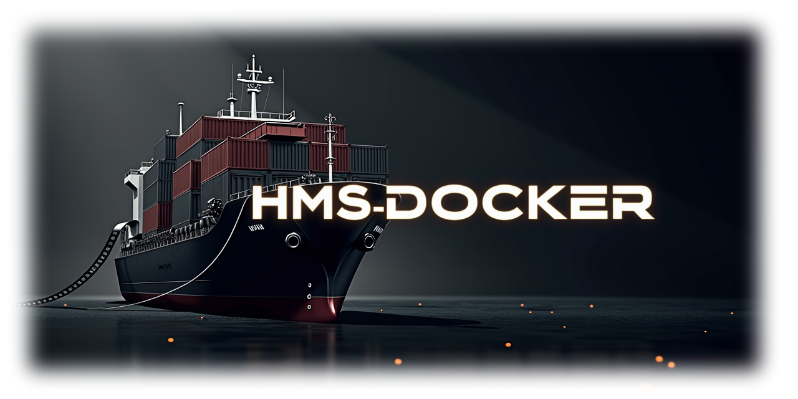

 

# HMS-Docker

Ansible Playbook to setup an automated Home Media Server stack running on Docker across a variety of platforms with support for GPUs, SSL, SSO, DDNS, and more.

## Features

- GPU acceleration for media transcoding
  - Intel and Nvidia GPU support
  - You must install the drivers for your Nvidia GPU yourself, it is not included in this playbook, but it will verify GPU acceleration is available
- Automatic Docker installation
- Automatic container updates
- Automatic App Initialization (Sonarr, Radarr, Prowlarr, etc.)
- Dynamic DNS updates with Cloudflare
- Wildcard SSL certificate generation
- Support for multiple network shares
- Single Sign-On with Authentik
- Support for separate 4K instances of Sonarr and Radarr
- Automated dashboard configuration in [Homepage](https://gethomepage.dev/)
- Custom scripts
  - Advanced monitoring script(s) for Uptime-Kuma to detect if media is actually accessible by the Plex container
  - Convert Traefik certificate file to a Plex-supported certificate file (PKCS12)

## Getting Started

Please see the docs page at: https://docs.hmsdocker.dev

## Contributing

Pull requests are always welcome!

If you have suggestions for containers to add or any other improvements, please submit a [Discussion Post](https://github.com/ahembree/ansible-hms-docker/discussions)
