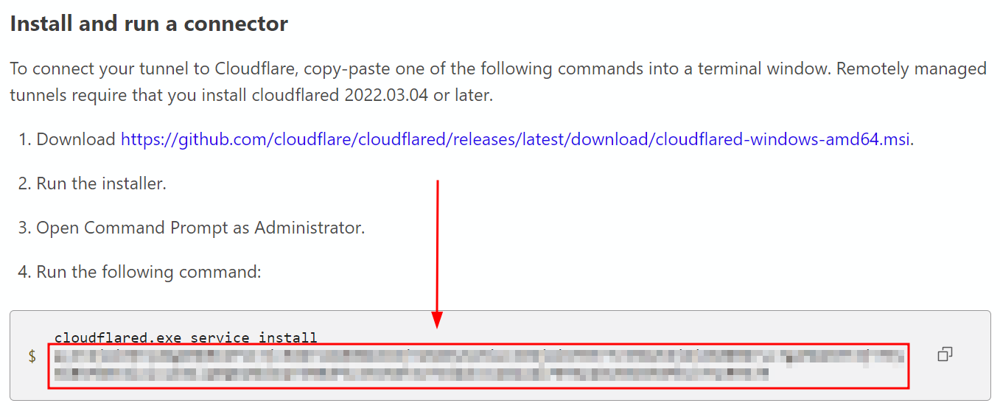
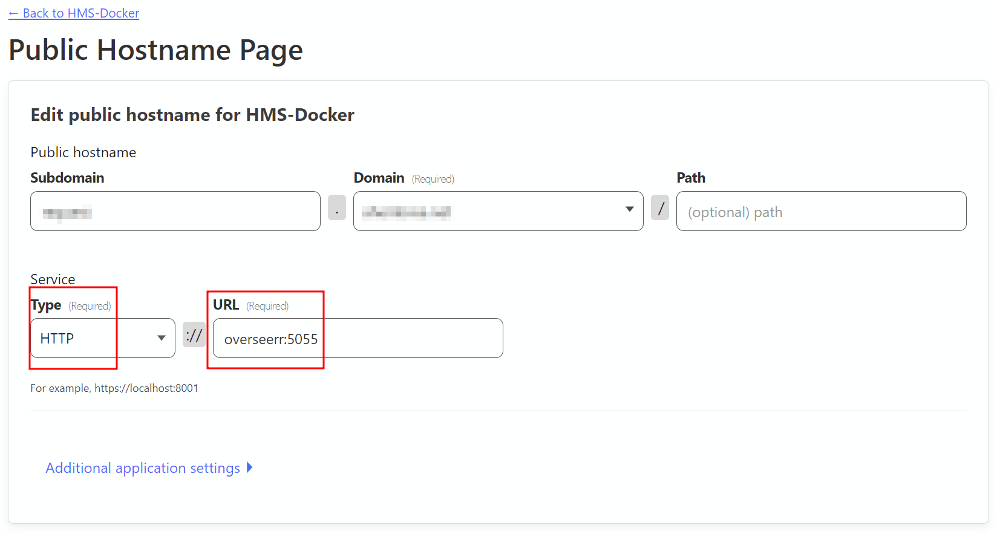

# Cloudflare

## Cloudflare DDNS

- Required settings for using Cloudflare DDNS:

  - A Cloudflare account and Cloudflare configured as your domains DNS servers
  - In `vars/custom/cloudflare_ddns.yml`
    - `cloudflare_ddns_enabled` : `yes` or `no` to enable/disable Cloudflare DDNS (default: `no`)
    - `cloudflare_api_token` : the API token of the Cloudflare account
    - `cloudflare_zone` : the domain name of the Cloudflare zone (e.g. `example.com`)
    - `cloudflare_ddns_subdomain` : the subdomain record (e.g. `overseerr` would be created as `overseerr.example.com`) (default: `overseerr`)
    - `cloudflare_ddns_proxied` : `'true'` or `'false'` to enable/disable proxying the traffic through Cloudflare (default: `'true'`)

## Cloudflare Tunnel

1. You will need to first generate a token by following the steps [here](https://developers.cloudflare.com/cloudflare-one/connections/connect-apps/install-and-setup/tunnel-guide/remote/#1-create-a-tunnel)

    a. You can find the token here:

    

2. Once you've generated the token, update the variables in `vars/custom/cloudflare.yml`:

    - `cloudflare_tunnel_enabled` to `yes`
    - `cloudflare_tunnel_token` to your token

3. After the container has been started, you should now see an active Connector in your Cloudflare dashboard

4. Follow [the steps here](https://developers.cloudflare.com/cloudflare-one/connections/connect-apps/install-and-setup/tunnel-guide/remote/#2-connect-an-application) to link containers to the tunnel, following the [container map](./Container%20Map.md) for the available container names and ports (use the container name as the "Service" name in the Cloudflare webgui, and append the port, e.g. `overseerr:5055`)

Example:

## Important Notes

The "public hostname" you use for the container does not need to match any Traefik proxy rule as **this traffic does NOT pass through Traefik**, it goes directly from the container -> Cloudflare.

This also means that **SSO using Authentik will not work for any container configured to go through the Tunnel** due to the authentication middleware being applied by Traefik. In order to use Authentik with a publicly accessible container, you will need to port-forward.
