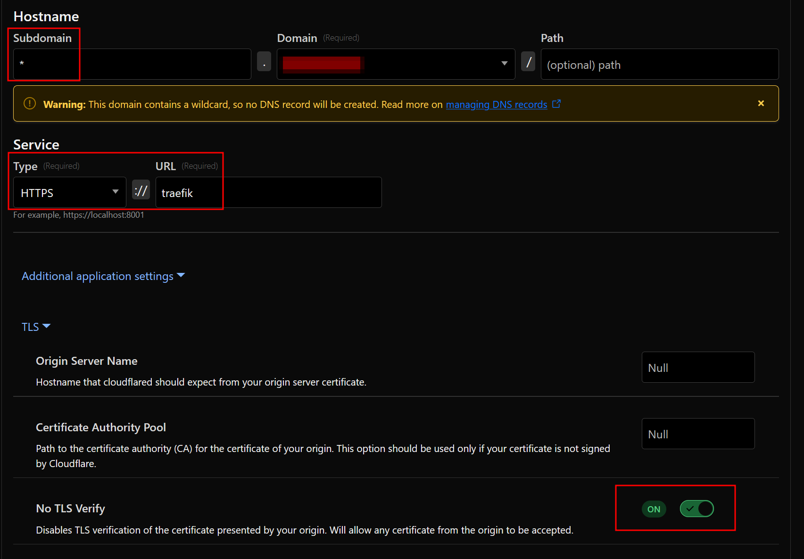

# Authentik

:::warning

In order to use Authentik, you must be using [SSL](traefik/ssl.md) as outlined in this project.

:::

This Authentik installation is based on the [single application](https://goauthentik.io/docs/providers/proxy/forward_auth#single-application) proxy provider configuration.

There are no authentik proxy containers defined in the `docker-compose.yml` file. This is because authentik will auto-detect the Docker socket and be able to start/stop its own proxy containers by using the configurations below.

Authentik is able to be controlled on a per-container basis, but requires a bit of configuration as outlined below.

## Important Note

:::warning

If you are using [Cloudflare Tunnel](./Cloudflare/tunnel.md) **AND** you have disabled port forwarding to 80/443, you **MUST** create a new "public hostname" in Tunnel in order for SSO to work since the SSO server needs to be publicly accessible. If your Tunnel is online and working, follow [step 4 when setting up Tunnel](./Cloudflare/tunnel.md) and configure it for the `authentik-server:9001` container.

However, any containers configured to be accessible through the Cloudflare Tunnel **will not be protected by Authentik if accessed via the Tunnel** if you do not configure it as outlined in [the 'Authentik through Cloudflare Tunnel' section below](#authentik-through-cloudflare-tunnel)

:::

## Enabling Authentik on Individual Containers

1. Enable the `authentik` container either in the [Container Map](../container-map.md) or within the `authentik.yml` config file

2. Set the `authentik` variable to `yes` for the containers you want in the [Container Map](../container-map.md).

3. Run the playbook as normal

4. Once all containers are started, go to `https://authentik.< domain >/if/flow/initial-setup/` to create the initial user and password to continue Authentik setup (if you changed the `proxy_host_rule` value for the authentik container, use that subdomain instead)

5. Configure an Application and Provider within Authentik

    a. Login

    b. Go to the Admin panel

    c. Expand `Applications` on the left

    d. Click `Applications`

    e. Click `Create with Provider`

    f. Give it the same name as the application (such as Sonarr)

    g. Select the Provider Type of `Proxy Provider`

    h. Select `Forward auth (single application)` and configure any other settings

    i. Set the `External host` to the URL of the application (such as `https://sonarr.< domain >`)

    j. Click through the menus, customizing what you want, and finish

6. Configure an Application Outpost

    a. Do a-c (above in step 5) again

    b. Click `Outposts` and then `Create`

    c. Give it a name, the `type` is `Proxy` and integration should be the `Local Docker connection`

    d. Select the application you created in step 5 to associate it to

    e. Expand `Advanced settings`

    :::tip

    **IMPORTANT**: copy the content of the file for the container generated in: `< hms_docker_apps_path >/authentik/outposts/authentik-< container_name >-output.yml` (so by default: `/opt/hms-docker/apps/authentik/outposts/...`) to your clipboard

    - If a configuration does not exist for the container you want, ensure you've enabled Authentik as outlined in steps 1 and 2

    :::

    f. Replace the configuration in the Authentik webpage with this generated configuration, otherwise stuff will not work correctly.

    g. Once you click create, it will automatically create a new `authentik-proxy` container that will handle authentication.

    h. It may take some time to download and setup the proxy, be patient

    :::note

    This `authentik-proxy` container (and also any associated networks it's connected to) will **not** be deleted if the Compose stack is removed since the container is not defined in the Compose file and the container is using those networks

    :::

7. Troubleshooting

    a. Using the Traefik and Portainer dashboards help a LOT during the troubleshooting process

    b. If you're getting a `404 not found` error, this is likely due to the `authentik-proxy` containers not working, running, or not being configured correctly. Check Portainer. If you just configured a new application outpost, wait a couple more minutes, but it should show in Portainer as well.

    c. If you're getting a `500` server error, this is possibly due to having duplicate Traefik routes for the same host rules, check Traefik logs and/or Portainer logs for the correct `authentik-proxy` container.

## Authentik through Cloudflare Tunnel

:::warning

This has not been fully tested as a "secure" solution. I am not responsible for any misconfigurations that may insecurely expose your applications. It is your responsibility to understand and accept the risks and implement security controls where possible.

You will also need to use a first-level subdomain for applications (such as `app1.example.com`) for Traefik TLS/SSL, you cannot use deeper than one level (`app1.sub.example.com`). This is a limitation of Cloudflare Tunnel and [requires you to purchase an Advanced Certificate for the hostname](https://developers.cloudflare.com/cloudflare-one/connections/connect-networks/get-started/create-remote-tunnel/#2a-publish-an-application) if you wish to do this.

This flow also bypasses the Traefik IP Allowlist controls since the request is seen as coming from the Tunnel container, which falls into the RFC1918 private address space

:::

After deploying the Cloudflare Tunnel by following up to Step 4 in the [Cloudflare Tunnel Docs](./Cloudflare/tunnel.md#requirements-and-enabling), follow these steps:

1. Set `hmsdocker_authentik_enabled_through_cftunnel` in `inventory/group_vars/all/authentik.yml` to `true`

    a. This is HIGHLY recommended so that Authentik is configured for containers by default

2. Create a new published application route with the following settings:

    a. Subdomain: `*`

    b. Domain: select your domain

    c. Service Type: `HTTPS`

    d. Service URL: `traefik`

3. Enable "No TLS Verify" in the Advanced application settings under TLS:

    

4. Manually create wildcard DNS `CNAME` record for `*.<domain>` that points to `<Tunnel ID>.cfargotunnel.com` and make sure it's proxied. You cannot create this record via the Tunnel dashboard

5. Test to see if it works

:::warning

If you ever decide to disable/remove Authentik in the future, YOU MUST CLEAN UP THE CLOUDFLARE TUNNEL MANUALLY BEFORE DOING SO, otherwise services will be exposed to the public WITH NO PROTECTION through the Tunnel

:::

## How the Authentik secret keys are stored

There are 2 files created when enabling Authentik, `.authentik.key` and `.authentik.pgpass` within the project directory. These files store the Authentik secret key and Authentik postgres database password respectively. For security, these files are owned by `root:root` with mode `0600` so no one other than the root user can read/modify them.

These values are stored in these files for persistence since they are generated randomly upon first launch and are required for Authentik to work correctly. If these values are changed or lost, Authentik will no longer work and will need to be reset to defaults.

Since the `.env` file will be continually updated with new values and these 2 randomly generated values need to remain persistent, Ansible will read/`slurp` these 2 files created and retrieve the values, ensuring the values within the `.env` are the same each time during every playbook run.

To ensure these key and pgpass files are not changed by Ansible, `force: no` is set on the template resource that creates these files.

## Upgrading Authentik

In Version 1.12, Authentik was upgraded from version `2025.2.4` to the current latest version, `2025.8.4`.

This upgrade introduced a Postgresql update from v12 to v16, which requires performing a manual database update and migration to the new version.

### Wiping and Starting Fresh

If you do not want to do this and do not care to wipe Authentik and start from scratch, you can do the following:

```bash
cd /opt/hms-docker
sudo docker compose down

cd /opt/hms-docker/apps
sudo rm -rf authentik

docker volume rm -f hms-docker_authentik_database hms-docker_authentik_database_backup hms-docker_authentik_geoip hms-docker_authentik_redis
```

Then re-run the playbook using `sudo make apply` and follow the steps above in [Enabling Authentik on Individual Containers](#enabling-authentik-on-individual-containers)

### Performing Upgrade

The steps below have been adapted from these official docs: https://docs.goauthentik.io/troubleshooting/postgres/upgrade_docker/

Please note I am not responsible for any data loss during this process.

1. Comment out/remove these lines from the `authentik-postgresql` container in `/opt/hms-docker/compose_files/authentik.yml` (lines 6 and 7):

    ```yaml
    networks:
      - authentik_net
    ```

2. Add the following to an existing or new `/opt/hms-docker/docker-compose.override.yml` file:

    ```yaml
    services:
      authentik-postgresql:
        image: postgres:12-alpine
        network_mode: none

      authentik-redis:
        image: redis:alpine

      authentik-server:
        image: ghcr.io/goauthentik/server:latest

      authentik-worker:
        image: ghcr.io/goauthentik/server:latest
    ```

3. Run the following commands to perform a backup of the existing database (this will take down Authentik during this process):

    a. Start containers with new override values:

    ```bash
    cd /opt/hms-docker
    sudo docker compose up -d
    ```

    b. Create directory to store backup

    ```bash
    # In /opt/hms-docker
    sudo mkdir authentik_upgrade_pg12 && sudo chown ${USER}:${USER} authentik_upgrade_pg12
    cd authentik_upgrade_pg12
    ```

    c. Perform postgresql dump to file

    ```bash
    # In /opt/hms-docker/authentik_upgrade_pg12
    sudo docker compose -f ../docker-compose.yml -f ../docker-compose.override.yml exec authentik-postgresql pg_dump -U authentik -d authentik -cC > upgrade_backup_12.sql
    ```

    d. Validate that the new `upgrade_backup_12.sql` file contains your data

    e. Stop only the authentik containers

    ```bash
    cd /opt/hms-docker
    sudo docker compose down authentik-postgresql authentik-redis authentik-server authentik-worker
    ```

    f. Create new volume for database backup

    ```bash
    docker volume create hms-docker_authentik_database_backup && docker run --rm -v hms-docker_authentik_database:/from -v hms-docker_authentik_database_backup:/to alpine sh -c 'cd /from && cp -a . /to'
    ```

    g. DANGER: this next command will delete the (now backed up) database, ensure the backup has the correct data before continuing

    ```bash
    docker volume rm -f hms-docker_authentik_database
    ```

4. Change the `/opt/hms-docker/docker-compose.override.yml` file to:

    ```yaml
    services:
      authentik-postgresql:
        image: docker.io/library/postgres:16-alpine
        network_mode: none

      authentik-redis:
        image: docker.io/library/redis:alpine

      authentik-server:
        image: ghcr.io/goauthentik/server:2025.8

      authentik-worker:
        image: ghcr.io/goauthentik/server:2025.8
    ```

5. Run the following commands:

    a. Pull new images with the new override images and start and force recreate only the postgresql container:

    ```bash
    cd /opt/hms-docker
    sudo docker compose pull authentik-postgresql authentik-redis authentik-server authentik-worker && sudo docker compose up --force-recreate -d authentik-postgresql
    ```

    b. Import the backup into the new postgresql container

    ```bash
    cd /opt/hms-docker/authentik_upgrade_pg12
    cat upgrade_backup_12.sql | sudo docker compose -f ../docker-compose.yml -f ../docker-compose.override.yml exec -T authentik-postgresql psql -U authentik
    ```

6. Change the `/opt/hms-docker/docker-compose.override.yml` to (just removing the `network_mode: none` line):

    ```yaml
    services:
      authentik-postgresql:
        image: docker.io/library/postgres:16-alpine

      authentik-redis:
        image: docker.io/library/redis:alpine

      authentik-server:
        image: ghcr.io/goauthentik/server:2025.8

       authentik-worker:
        image: ghcr.io/goauthentik/server:2025.8
    ```

7. Force recreate all Authentik containers with new images:

    ```bash
    sudo docker compose up --force-recreate -d authentik-postgresql authentik-redis authentik-server authentik-worker
    ```

8. Run the new version of the playbook using `sudo make apply`

9. Validate that Authentik is running, contains your data, and is on the latest version (2025.8.4)

10. Delete the `docker-compose.override.yml` file if not in use, otherwise remove the entries added for Authentik during this process

11. Run `sudo docker compose up -d` after removing or modifying the `docker-compose.override.yml` file

12. Once you've confirmed everything is working as expected, you can then remove the database backup volume by running `docker volume rm hms-docker_authentik_database_backup`
