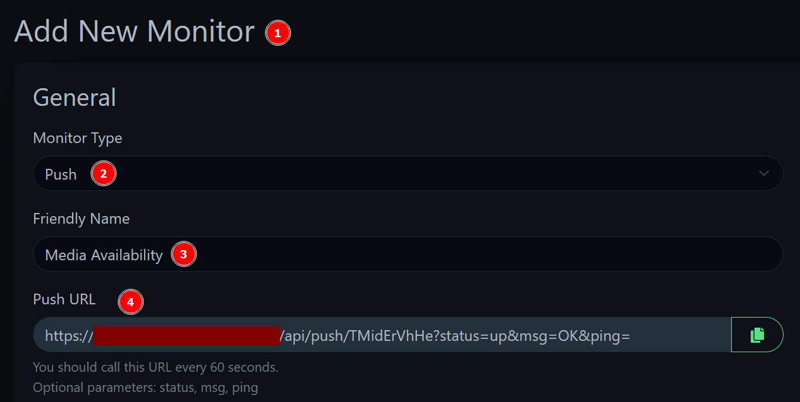

# Custom Scripts

## Plex SSL Conversion Script

A script that will convert the certficate generated by Traefik for use within Plex (PKCS#12 format) if you have a need for it.

### Enabling the Plex SSL Conversion Script

All variables listed below are in `inventory/group_vars/all/plex.yml`

To enable the Traefik-to-Plex Certificate script:

1. Change `hms_docker_plex_ssl_enabled` to `true`

2. Set `hms_docker_plex_ssl_subdomain` to the subdomain used to access Plex on your domain name

    a. For example, if your domain was `example.com` and the subdomain to access Plex was `media.example.com`, set this value to `media`

    b. NOTE: It **must** match a hostname, wildcard or SAN covered by the Traefik certificate

The following settings are optional:

- `hms_docker_plex_ssl_update_config` : If the script should auto-update the Plex config file with the certificate path and passphrase (if applicable)
- `hms_docker_plex_ssl_restart_plex` : If the script should restart the Plex container after the config has been updated
- `hms_docker_plex_ssl_cert_pass` : The passphrase for the certificate if you want to further secure it, but it is not necessary

## Uptime-Kuma Media Availability Script

A script that will monitor for media availability within Plex.

Sometimes, a network connection goes down or NFS may not mount correctly after a reboot, so media will be marked as "Unavailable" within Plex even though the container is running.

This script will query the Plex API for the latest movie and check if Plex can actually access the file (based on the API response). If it cannot, it will notify Uptime-Kuma via a Push monitor. This is useful to quickly be notified of disk access issues.

The script runs on a cron job every minute

### Enabling the Media Availability Monitoring Script

All variables listed below are in `inventory/group_vars/all/scripts.yml`

To enable the script:

1. Set `monitoring_scripts_enabled` to `true`

2. Set `media_avail_script_enabled` to `true`

3. Create a "Push Monitor" within Uptime-Kuma, I recommend the following settings:

    a. Heartbeat Interval: 90

    b. Retries: 5

    c. Heartbeat Retry Interval: 90

4. Set the Push URL as `media_avail_kuma_push_url`, and remove `?status=up&msg=OK&ping=` from the end

